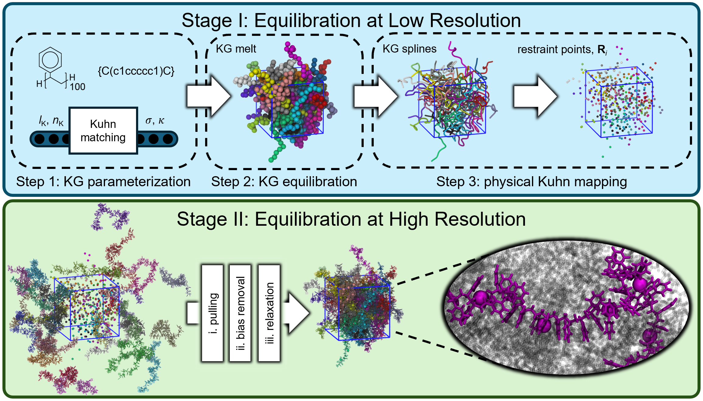

# GAMERS
Repository for General Approach for Macromolecular Equilibration via Restrained Simulations

<br />

<br />

This README explains how to run the GAMERS pipeline using the scripts provided in this repository. It assumes you have cloned the repo and will edit a single input file before running the pipeline. Along with GAMERS scripts, this repository contains example GAMERS input and output files for the generation of a polystyrene melt.

## Quick start commands

- **Clone the repository:**
  ```bash
  git clone https://github.com/webbtheosim/GAMERS.git
  cd GAMERS
  ```

- **Edit the input file:**
  
  Open `GAMERS.input` at repository root and adjust path to desired directory.
  ```bash
  output_directory:/absolute/path/to/your/workdir
  ```
  Other parameters in `GAMERS.input` can be adjusted to generate a different system (see Input parameters below).

- **Run Stage I (in order):**
  ```bash
  python stage_I/step_1.py
  python stage_I/step_2_in_maker.py
  lammps stage_I/step_2/inputs/step_2.in
  python stage_I/step_3.py
  ```

- **Generate or provide input files for Stage II:**
  ```bash
  python openff_system_maker.py
  ```
  This will generate the required files with openff-toolkit, namely
  <ol type="1">
    <li>stage_II/inputs/sys.pdb: a properly formatted .pdb file containing all atoms of the system named </li>
    <li>stage_II/inputs/sys.xml: an openmm system object matching sys.pdb</li>
  </ol>
  
- **Run Stage II:**
  ```bash
  python stage_II/stage_II.py
  ```

Outputs will be written to the locations configured in `GAMERS.input` (see Path configuration below).

## Input parameters

Select  `GAMERS.input` parameters are described below:
- restrained_force_prefactor(kJ/mol/amu/nm^2): the spring constant *k<sub>sh</sub>* of the semiharmonic restraint potential of stage II phase i
- restrained_simulation_length(ns): the length of stage II phase i (the pulling portion)
- annealing_simulation_length(ns): the length of stage II phase iii (the entire annealing relaxation protocol)
- npt_simulation_length(ns): the length of post-GAMERS isobaric relaxation
- monomer_smiles: the smiles string for the monomer of interest
- smiles_connection_index: the index of the final backbone atom of the monomer smiles string (see examples below)
- head_smiles: the smiles string for the head of a chain (left empty for hydrogen)
- tail_smiles: the smiles string for the tail of a chain (left empty for hydrogen)

The smiles_connection_index counts from the end of the smiles string to the until reaching a backbone atom, ignoring symbols.
This is the atom that will connect to the next monomer during polymerization, which is important for the logical reindexing of OpenFF-generated systems.
Below are example monomer_smiles and smiles_connection_index combinations for select polymers:
- PEO: COC, -1
- *cis*-PBD: C/C=C\C, -1
- PC: c1ccc(cc1)OC(=O)Oc1ccc(cc1)C(C)(C) -3
- PS: C(c1ccccc1)C, -1

## File map and purpose
- `GAMERS.input` — central input file read by all Python scripts; contains /absolute/path/to/your/workdir and system-specific settings.
- `stage_I/step_1.py` — creates the HR → KG mapping (`stage_I/step_1.mapping`) and prepares the LAMMPS data/topology files for step 2.
- `stage_I/step_2_in_maker.py` — generates `stage_I/step_2_inputs/step_2.in` (LAMMPS input) by adding parameters to `stage_I/step_2_inputs/step_2_base.in`.
- `stage_I/step_2_inputs/step_2.in` — generates equilibrated KG melt positions in `stage_I/step_2.end` for use in step 3.
- `stage_I/step_3.py` — creates restraint point IDs and positions (`stage_I/step_3_restraint.ids` and `stage_I/step_3_restraint.pos`) from `stage_I/step_2.end` and `stage_I/step_1.mapping` for Stage II.
- `stage_II/stage_II.py` — runs the OpenMM-based Stage II simulation that consumes restraint files and produces final position/velocity files, found in `stage_II/final_positions`, for each phase of GAMERS.
- `openff_system_maker.py` — optional generation of OpenMM input files (e.g. sys.xml) with SAGE force field (use as needed in your workflow).

A detailed description of GAMERS and all the stages/steps/phases can be found at https://doi.org/10.1021/acs.jctc.5c01332.

## Path configuration
- Edit the single file `GAMERS.input` at the repository root to configure runs.
- Set the variable `/absolute/path/to/your/workdir` to an absolute path for your working directory:
  ```bash
  output_directory:/absolute/path/to/your/workdir
  ```

- All scripts read configuration from `GAMERS.input`. Changing only `GAMERS.input` will redirect where inputs and outputs are read/written.

## Force-field compatability with stage_II.py
As designed, `stage_II/stage_II.py` expects `stage_II/inputs/sys.xml` to have nonbonded forces described by a single OpenMM NonbondedForce object named "Nonbonded force".
The `pull_forcefield_generator_simple` python function (stage_II.py line 47) handles the generation of the soft forces from the force field parameters contained in `stage_II/inputs/sys.xml`.

If a force field requires the definition of an additional OpenMM CustomNonbondedForce object, such as CHARMM or OPLS, `stage_II/stage_II.py` must be altered.
An example for handling this senario is included in `stage_II/stage_II.py`;
commenting lines 276 and 326 and uncommenting lines 277 and 327 of `stage_II/stage_II.py` will implement the `pull_forcefield_generator_custom_force_present` python function (`stage_II/stage_II.py` line 89), which was written to properly read force-field parameters from both the NonbondedForce and CustomNonbondedForce objects.
This implementation is specifically written to handle the CustomNonbondedForce required for OPLS geometrix mixing of LJ parameters in Openmm (see `Geometric` python class in `stage_II/stage_II.py` line 14).

## Dependencies
- Python 3.8+
- Python packages: `numpy`, `numba`, `scipy`, `openmm`, `openff-toolkit`, `rdkit`
- LAMMPS — required to execute the generated `step_2.in`

## Troubleshooting and notes
- If a script fails to find files, confirm `/absolute/path/to/your/workdir` in `GAMERS.input` and ensure the directory exists and is writable.
- If you see import errors, install the missing packages into the active Python environment.
- If you modified scripts to inline variables, revert them to read from `GAMERS.input` to keep a single authoritative configuration.
- Logging and intermediate files: check the directories configured in `GAMERS.input` for outputs created by each step.
- Typical run order must be preserved: `step_1.py` → `step_2_in_maker.py` → `step_2.in` → `step_3.py` → `stage_II.py`.

## License and attribution
- Repository source: https://github.com/webbtheosim/GAMERS
- Please keep attribution to the original GAMERS authors in derivative documentation.
